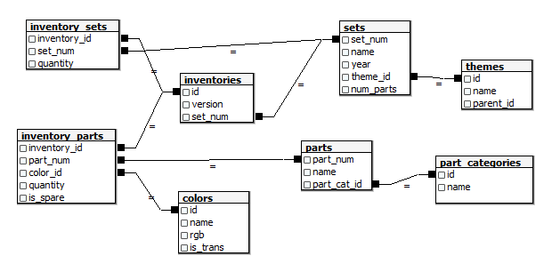

```{r echo=FALSE, message=FALSE, warning=FALSE}
library(tidyverse)
library(knitr)
l_themes <- read_csv("../data/lego/themes.csv", col_types = cols("i", "c", "i"))
l_sets <- read_csv("../data/lego/sets.csv", 
                     col_types = cols("c", "c", "i", "i", "i"))
l_inv_sets <- read_csv("../data/lego/inventory_sets.csv", 
                     col_types = cols("i", "c", "i"))
l_parts <- read_csv("../data/lego/parts.csv", col_types = cols("c", "c", "i"))
l_part_cat <- read_csv("../data/lego/part_categories.csv",
                     col_types = cols("i", "c"))
l_inv_parts <- read_csv("../data/lego/inventory_parts.csv", 
                     col_types = cols("i", "c", "i", "i", "c"))
l_inv <- read_csv("../data/lego/inventories.csv", 
                     col_types = cols("i", "i", "c"))
l_colors <- read_csv("../data/lego/colors.csv",
                     col_types = cols("i", "c", "c", "c"))
```

# Lego Dataset

The dataset that we shall work on, can be downloaded from Canvas. This dataset
contains the LEGO Parts/Sets/Colors and Inventories of every official LEGO set
in the Rebrickable database. These files were current as of July 2017.

LEGO is a brand of toy building bricks. LEGO bricks are often sold in "sets",
which allow the owner to build specific objects, for instance an X-wing fighter
from Star Wars Episode IV, or Bilbo's home from The Hobbit. Each set can be
classified under a theme. Each set contains parts, which have a part number, and
a category. Parts also differ in terms of their colour. There is also an 
inventory of sets and version numbers.

The dataset is provided in eight csv files. Here is the schema that identifies 
how the files are linked together.

```{r echo=FALSE, out.width="80%", fig.align="center"}

```

Use the tables to answer the following questions:

1. Consider the tables in `sets.csv` and `themes.csv`. Suppose we extract 3 major themes:
   * Star Wars: `id` or `parent_id` between 158 and 185.
   * Lord of the Rings: `id` between 561 and 569.
   * Superheros: `id` between 482 and 493.
   
   Re-create the following table, which shows the number of different sets in each
   decade:
```{r}
l_themes <- mutate(l_themes, 
                 major_theme = case_when(
                   between(id, 158, 185) | between(parent_id, 158, 185) ~ "Star Wars",
                   between(id, 561, 569) ~ "Lord of The Rings",
                   between(id, 482, 493) ~ "Superhero",
                   TRUE ~ "Other"
                 )) 
l_sets %>% mutate(decade = cut_interval(year, length=10, dig.lab=4, right=FALSE )) %>% 
  left_join(l_themes, by=c("theme_id"="id")) %>% 
  group_by(decade, major_theme) %>% count() %>% 
  ungroup() %>%
  pivot_wider(id_cols="major_theme", names_from="decade", values_from="n",
              values_fill = 0) %>%  kable()
```

2. Still working with `sets.csv` and `themes.csv`, which are the themes that do 
   not have any associated sets?
```{r}
anti_join(l_themes, l_sets, by=c("id" = "theme_id"))
```

3. When we perform a left join between `sets` and `inventories` tables, the
number of rows changes. Why? Identify the cause for this.

When we left_join(sets, inventories), we end up with 11 more rows. The reason is
because of duplicate set_nums in the inventories table. To see which are the
set_nums that are duplicated, we can do this:

The set numbers in the `sets` table are unique, so the increase is due to 
duplicated set numbers in the inventory table.

```{r}
# Most direct way:
l_inv %>% group_by(set_num) %>% count() %>%
  filter(n > 1) %>% 
  left_join(l_inv)
```

4. The `rgb` column in the `colors` table contains the RGB specification in 
   hexadecimal format. Reshape the table into the following format:
```{r}
l_colors %>% #head() %>% 
  separate(rgb, into = c("R", "G", "B"), sep=c(2,4)) %>% 
  pivot_longer(cols=R:B, names_to="channel", values_to="hex") %>% 
  mutate(dec=strtoi(paste("0x", hex, sep=""), 16)) -> q4_df
q4_df %>% head() %>% kable()
```

Alternative methods for this column include:

* Using `str_sub` instead of `separate`
* Using `str_match` to extract the channels into a matrix (with 4 columns), and 
  then cbind-ing it back to the data.
  
Hexadecimal is base-16 representation of numerals. The letters A to F represent
the decimal numbers 10 to 15. In many computing languages, we use the notation
`0x14` to represent hexadecimal values. So for instance,

* `0x12` is equal to $2 \times 16^0 + 1 \times 16^1 = 18$ in the decimal system.
* `0xAB` is equal to $11 \times 16^0 + 10 \times 16^1 = 171$ in decimal.

The following code converts a string representation of hexadecimal into a numeric 
representation:
```{r}
strtoi("0xAB")
```

5. Collapse each colour in the tidy data frame from Q4, to contain the 
   predominant channel(s) in each named LEGO colour:
   
```{r}
dom_colour <- function(channel, dec_val) {
  keep <- sort(channel[min_rank(desc(dec_val)) == 1], decreasing=TRUE)
  paste(keep, collapse="")
}
q4_df %>% group_by(name) %>% 
  summarise(dom_col = dom_colour(channel, dec)) %>% head() %>% kable()
```

6. Which sets (from `sets.csv`) do not have any Bricks (from `part_categories.csv`) 
   in them?
```{r}
inv_parts_no_bricks <- l_inv_parts %>% left_join(l_parts, by="part_num") %>% 
  left_join(l_part_cat, by=c("part_cat_id"= "id")) %>% 
  group_by(inventory_id) %>% 
  summarise(b_no_b = any(str_detect(name.x, "Brick")), .groups="drop") %>% 
  filter(!b_no_b)

l_sets %>% left_join(l_inv) %>% 
  semi_join(inv_parts_no_bricks, by=c("id"="inventory_id"))
```  
